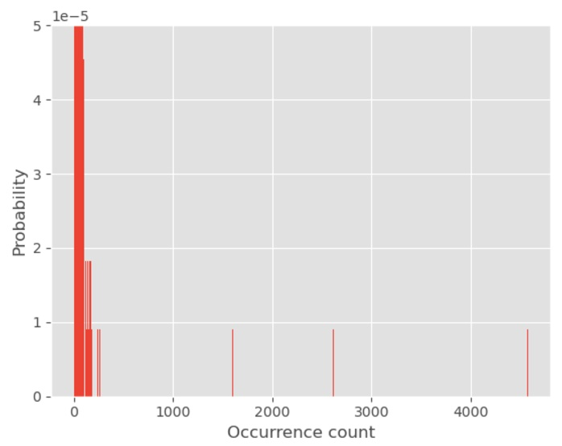
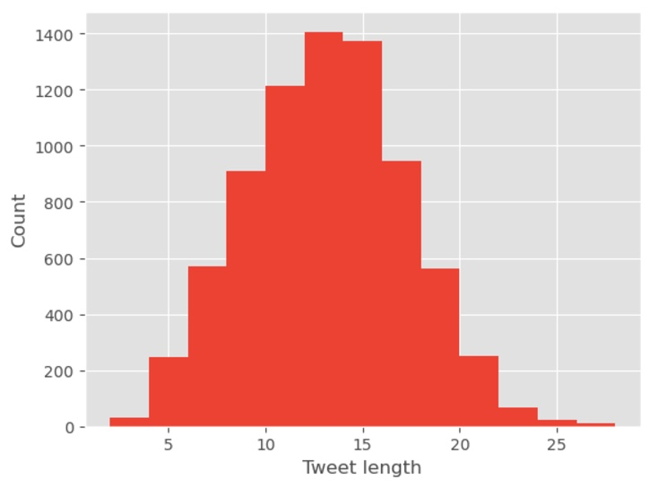
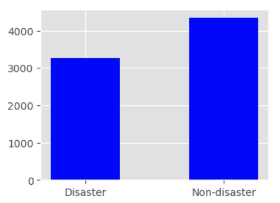

# disaster-or-not
Udacity MLE nanodegree capstone

## I. Project Overview

This project is about predicting if someone is talking about disaster or not in a tweet. The data was downloaded from a Kaggle challenge called ”Natural Language Processing with Disaster Tweets”, and it has 7613 tweets for training as a csv file. There are four columns in the data file; keyword, location, text, and target. A few lines of train data are shown below. As can be seen, text is tweet, and target is disaster (1) or non-disaster (0). The goal of this project is to use the left three columns to predict the target.

The data was downloaded from a Kaggle website: 

[www.kaggle.com/competitions/nlp-getting-started/data](https://www.kaggle.com/competitions/nlp-getting-started/data)

This problem can be tackled from many other algorithms, but in this project Natural Language Processing method (NLP) will be used. First of all, as a benchmark Long short-term memory (LSTM) method will be developed and optimized to obtain its prediction results. A more powerful Bi-directional Encoder Representations from Transformer (BERT) method will be used to see how much the prediction can be improved. A pre-trained BERT model will be used instead of creating one from scratch.

## II. Exploratory Data Analysis

To select the size of vocabulary, the number of occurrences of words in the corpus were counted and shown in a plot below.
Out of 12495 unique words in the corpus, 5454 words appeared more than once. Therefore, the vocabulary size is set at 5000. 

To get an idea of how many words are used in tweets, tweet lengths were counted in the training dataset.
Distribution of number of words in each tweet is plotted, showing that most of the tweets are 6 to 20 words long. 

The numbers between disaster and non-disaster tweets are shown below. There is a data imbalance, and this will be addressed during the data preprocessing step.

