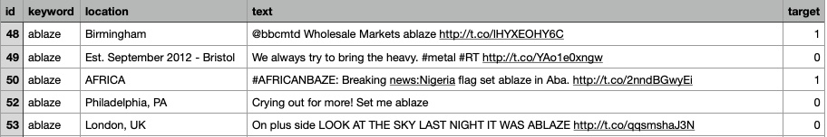

# disaster-or-not
### Udacity MLE nanodegree capstone

## I. Project Overview

This project is about predicting if someone is talking about disaster or not in a tweet. The data was downloaded from a Kaggle challenge called ”Natural Language Processing with Disaster Tweets”, and it has 7613 tweets for training as a csv file. There are four columns in the data file; keyword, location, text, and target. A few lines of train data are shown below. As can be seen, text is tweet, and target is disaster (1) or non-disaster (0). The goal of this project is to use the left three columns to predict the target.

The data was downloaded from a Kaggle website: 

[www.kaggle.com/competitions/nlp-getting-started/data](https://www.kaggle.com/competitions/nlp-getting-started/data)

This problem can be tackled from many other algorithms, but in this project Natural Language Processing method (NLP) will be used. First of all, as a benchmark Long short-term memory (LSTM) method will be developed and optimized to obtain its prediction results. A more powerful Bi-directional Encoder Representations from Transformer (BERT) method will be used to see how much the prediction can be improved. A pre-trained BERT model will be used instead of creating one from scratch.

## II. Exploratory Data Analysis

- The number of occurrences of words in the corpus were counted. Out of 12495 unique words in the corpus, 5454 words appeared more than once. Therefore, the vocabulary size was set at 5000. 
- Tweet lengths were counted in the training dataset, and most of the tweets were 6 to 20 words long. 
- There is a data imbalance (disater vs non-dsater tweets), and this was addressed during the data preprocessing step.
- Keywords were explored to see what kind of words are used in disaster tweets, and most used words in disaster tweets were explored as well.

## III. LSTM Analysis: Benchmark

### 1. Data Preprocessing

1. The text column is combined with location and keyword columns to make one combined text column to feed to NLP model.
2. Since there is a data imbalance as seen in the EDA section (negative tweets: 4342, positive tweets: 3271), the positive tweets were oversampled by randomly selecting duplicate 1071 tweets from itself.
3. Empty cells in location and keyword columns were replaced with a string "NA". This is a unique word, so that it can be distinguished from all the other words.
4. The dataset was split into three groups; train 60\%, validation 20\%, and test 20\%. Here the test dataset is a hold-out set for final testing of optimized models. Scikit-learn was used to split the dataset.
5. Using nltk module, the train and validation datasets are tokenized, and their stop words were removed.
6. The total number of vocabulary is 12495. But as seen in the EDA section, 7041 words appear only once. The vocabulary size is set at 5000.
7. The maximum length of tokenized tweets is 28 in the entire train/valid/test dataset. Any tweets longer than 28 were truncated, and any ones shorter than 28 were padded with 0's. 
8. The tokenized and padded words for train and validation dataset were saved as csv files for reuse in later analysis steps.
9. Using PyTorch's TensorDatset and DataLoader classes, train dataset were converted to dataloaders with a given batch size.

### 2. LSTM Model Development

#### 1) LSTM algorithm
Long short-term memory (LSTM) algorithm is a type of recurrent neural network (RNN) that can retains long term dependencies of previous inputs. From this retention it can influence the decision that is made much later from a particular input. Like in a long sentence, a certain word in front influences a form of words (tense or meaning) near the end of the sentence. RNN suffered the vanishing gradient problem, but LSTM mitigated it.

The LSTM architectures involve the memory cell which is controlled by three gates: the input gate, the forget gate, and the update gate. These gates decide what information to add to, remove from, and output from the memory cell. In the image below, the three sigmoid functions are the gates, and they determine if the C value running horizontally above them should be forgotten or retained.

<figure>

<figcaption align = "center"> YOUR CAPTION </figcaption>
</figure>
