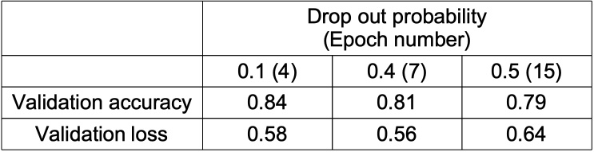

# disaster-or-not
### Udacity MLE nanodegree capstone

## I. Project Overview

This project is about predicting if someone is talking about disaster or not in a tweet. The data was downloaded from a Kaggle challenge called ”Natural Language Processing with Disaster Tweets”, and it has 7613 tweets for training as a csv file. There are four columns in the data file; keyword, location, text, and target. A few lines of the training data are shown below. As can be seen, text is tweet, and target is disaster (1) or non-disaster (0). The goal of this project is to use the left three columns to predict the target.

The data was downloaded from a Kaggle website: 

[www.kaggle.com/competitions/nlp-getting-started/data](https://www.kaggle.com/competitions/nlp-getting-started/data)

This problem can be tackled from many other algorithms, but in this project Natural Language Processing method (NLP) was used. First of all, as a benchmark Long short-term memory (LSTM) method was developed and optimized to obtain its prediction results. A more powerful Bi-directional Encoder Representations from Transformer (BERT) method was used to see how much the prediction can be improved. A pre-trained BERT model was used instead of creating one from scratch.

## II. Exploratory Data Analysis

- The number of occurrences of words in the corpus were counted. Out of 12495 unique words in the corpus, 5454 words appeared more than once. Therefore, the vocabulary size was set at 5000. 
- Tweet lengths were counted in the training dataset, and most of the tweets were 6 to 20 words long. 
- There is a data imbalance (disater vs non-dsater tweets), and it was addressed during the data preprocessing step.
- Keywords were explored to see what kind of words were used in disaster tweets, and most used words in disaster tweets were explored as well.

## III. LSTM Analysis: Benchmark

### 1. Data Preprocessing

1. The text column was combined with location and keyword columns to make one combined text column to feed to NLP model.
2. Since there is a data imbalance (negative tweets: 4342, positive tweets: 3271), the positive tweets were oversampled by randomly selecting duplicate 1071 tweets from itself.
3. Empty cells in location and keyword columns were replaced with a string "NA". This is a unique word, so that it can be distinguished from all the other words.
4. The dataset was split into three groups; train 60\%, validation 20\%, and test 20\%. Here the test dataset is a hold-out set for final testing of optimized models. Scikit-learn was used to split the dataset.
5. Using nltk module, the train and validation datasets were tokenized, and their stop words were removed.
6. The total number of vocabulary is 12495, out of which 7041 words appear only once. The vocabulary size was set at 5000.
7. The maximum length of tokenized tweets is 28 in the entire train/valid/test dataset. Any tweets longer than 28 were truncated, and any ones shorter than 28 were padded with 0's. 
8. The tokenized and padded words for train and validation dataset were saved as csv files for reuse in later analysis steps.
9. Using PyTorch's TensorDatset and DataLoader classes, train dataset were converted to dataloaders with a given batch size.

### 2. LSTM Model Development

#### 1) LSTM algorithm
Long short-term memory (LSTM) algorithm is a type of recurrent neural network (RNN) that can retains long term dependencies of previous inputs. From this retention it can influence the decision that is made much later from a particular input. Like in a long sentence, a certain word in front influences a form of words (tense or meaning) near the end of the sentence. RNN suffered the vanishing gradient problem, but LSTM mitigated it.

The LSTM architectures involve the memory cell which is controlled by three gates: the input gate, the forget gate, and the update gate. These gates decide what information to add to, remove from, and output from the memory cell. In the image below, the three sigmoid functions are the gates, and they determine if the C value running horizontally above them should be forgotten or retained.

<figure>

<figcaption>&nbsp;&nbsp;&nbsp;&nbsp;&nbsp;&nbsp;&nbsp;&nbsp;&nbsp;&nbsp;&nbsp;&nbsp;&nbsp;&nbsp;&nbsp;&nbsp;&nbsp;&nbsp;&nbsp;&nbsp;&nbsp;&nbsp;&nbsp;&nbsp; Image from www.projectpro.io/article/lstm-model/832 </figcaption>
</figure>

#### 2) Hyperparameter tuning
Epoch number was tuned from validation accuracy and loss. The plot below shows that the validation accuracy increased quite steeply initially and then plateaued after the epoch number of 12. The loss plot shows that after the epoch number of 12, there appeared overfitting. From these observations, the epoch number was set at 12.

With epoch number tuned in, the following hyperparameters were tuned with a grid search. 
- hidden dimension = [32, 64, 128] 
- number of LSTM layers = [1, 2, 3] 
- learning rate = [0.0003, 0.001, 0.01]

**Hyperparameter selection:**  
Accuracy, precision, recall, and f1 score were obtained from the grid search results. Based on them, the hyperparameters were selected as follows.  
- Learning rate: 0.001 
- Hidden dim: 32 
- Number of LSTM layers: 2 
- Epoch number: 12 

### 3. Inference test on the hold-out test dataset
Data preprocessing for this step was done without using dataloader method. To be able to run all of the test data, one tweet was tested at a time.  
Number of test dataset: 1737   
- Accuracy:  77.0\% 
- Precision:  75.6\% 
- Recall:  79.9\% 
- F1 score:  77.7\%

## IV. BERT Analysis

### 1. Data Preprocessing

1. The text column was combined with location and keyword columns to make a combined text column to feed to NLP model.
2. Since there is a data imbalance (negative tweets: 4342, positive tweets: 3271), the positive tweets were oversampled by randomly selecting duplicate 1071 tweets from itself.
3. Empty cells in location and keyword columns were replaced with a string "NA". This is a unique word, so that it can be distinguished from all the other words.
4. To use BERT, special tokens were added at the beginning ("[CLS] ") and end (" [SEP]") of each sentence for BERT to work properly.
5. To use in BERT model, attention masks were created by converting each token to 1 and leaving 0's untouched.
6. The dataset was split into three groups; train 60\%, validation 20\%, and test 20\%. Here the test dataset is a hold-out set for final testing of optimized models. Scikit-learn was used to split the dataset.
7. Using BertTokenizer module from Hugging Face transformers library, the train and validation datasets were tokenized, and their stop words were removed.
8. The maximum length of tokenized tweets is 28 in the entire train/valid/test dataset. Any tweets longer than 28 were truncated, and any ones shorter than 28 were padded with 0's. 
9. Using PyTorch's TensorDatset and DataLoader classes, train dataset were converted to dataloaders with a given batch size. 

### 2. BERT Model Development

#### 1) BERT algorithm
Bi-directional Encoder Representations from Transformer (BERT) algorithm is a deep learning model that adopts the mechanism of self-attention to capture dependencies and relationships within input sequences. Self-attention allows the model to identify and weigh the importance of different parts of the input sequence.  

As can be seen in the image below, multiple self-attentions are embedded in Multi-Head Attention, and BERT architecture uses encoding and decoding blocks, where decoding block receives input from encoding block's result. Essentially encoding figures out the meaning of the input text, and decoding would typically generate an output using the input from the encoder.

<figure>

<figcaption>Image from heidloff.net/article/foundation-models-transformers-bert-and-gpt   </figcaption>
</figure>  

In this present project, a pre-trained BERT model from Hugging Face was used. It can be imported from a module called transformers.  

#### 2) Hyperparameter tuning

Since a pre-trained BERT is used, the hyperparameter tuning process is considerably different from LSTM's. First of all, most of the hyperparameters are already optimized. So there will not be much optimization to be done as for hyperparameters, unless there are any warning signs that force us to touch upon particular hyperparameters.  

**Learning rate:**  
There is no need to optimize the learning rate, since BERT model can utilize an automatic learning rate optimizer; optimizer and scheduler. Also training warmup steps are used to start with a very low learning rate at the beginning and then increase its value after a few steps later.  

**Epoch number tuning:**  
When the BERT model was run on the train dataset with multiple epochs, an overfitting was observed as seen in the plot below. To remedy this, drop out probability hyperparameter was changed in the pre-trained BERT model's configuration. Drop out probability is a hyperparameter that controls how many percentage of neurons are to be turned off randomly to reduce overfitting. The plot below uses the default drop out probability of 0.1.  

When the default drop out probability of 0.4 was used, there is still an overfitting over epoch number. 

Drop out probabilities were increased to 0.5. The overfitting was somewhat alleviated. However, after the epoch number of 3, there appears an overfitting again in the loss plot. 

The drop out probability was changed hoping that we were allowed to increase the epoch number to get a better accuracy and a lower loss. However, as seen in the above three plots, even though higher drop out probability alleviated the overfitting with higher epoch numbers, its accuracy was worse than lower drop out probability's. So we had to select an epoch number that gave higher accuracy regardless of drop out probability.  

**Comparison between drop out probabilities:**  
The following table shows that the drop out probability of 0.1 performs the best with a smaller epoch number. It performs better with higher epochs, but loss gets much worse.

**Hyperparameter selection:**  
As seen in the analysis done above, there is an overfitting over epoch number in the pre-trained BERT model. It can be alleviated with higher drop out probability. However, the best validation accuracy score (84\%) comes from the drop out probability of 0.1 with epoch number of 4 before validation loss shoots up much above the train loss. Therefore, the following hyperparameters were selected.  
- Epoch number: 4  
- Drop out probability: 0.1  

### 3. Inference test on the hold-out test dataset  
Data preprocessing was done using dataloader method with batch size of 1 to be able to run all of the dataset without losing some in the last incomplete batch.  
Number of test data set: 1737  
- Accuracy:  83.8\%  
- Precision:  82.2\%  
- Recall:  86.3\%  
- F1 score:  84.2\%

## V. Results  
**Robustness of BERT model:**  
The validation accuracy run on the train dataset was 84\% as seen in the table in the previous section. When the model was run on the hold-out dataset, the accuracy was 83.8\%. This serves as robustness of the model.  

**Comparison between LSTM and BERT:**  
Compared to LSTM, BERT performed about 6 ~ 7\% better for all four metrics. This justifies that the final model adequately solved the problem.

<figure>

<figcaption>&nbsp;&nbsp;&nbsp;&nbsp;&nbsp;&nbsp;&nbsp;&nbsp;&nbsp;&nbsp;&nbsp;&nbsp;Both models were run on the same hold-out dataset.</figcaption>
</figure>  

